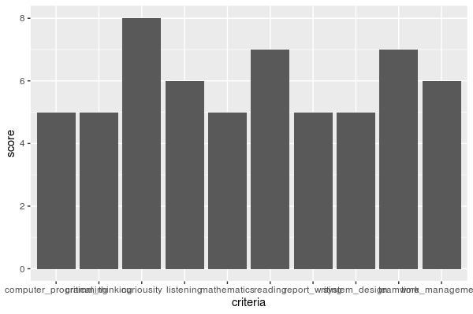

#Overview of My Data Science Profile

I am a curious person and have taken to studying data science. I like to provide solutions to problems.

```{r echo=FALSE}
# create data science profile
criteria<-c("reading","critical_thinking", "time_management","mathematics","computer_programming","system_design","report_writing","listening","teamwork","curiousity")
score<-c(7,5,6,5,5,5,5,6,7,8)

data_science_profile<-data.frame(criteria,score)

data_science_profile

library(ggplot2)

ggplot(
  data = data_science_profile, aes(x=criteria,y=score)) +
  geom_bar(stat = "identity")


```
